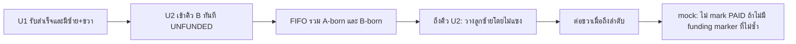

# 13VT — แบบจำลอง FIFO/UNFUNDED (ทดสอบออฟไลน์เท่านั้น)

> `UnfundedFifoModel.sol` **ไม่รับ ไม่ถือ และไม่โอน USDT/BNB**; operator จำลองสถานะ. ห้ามใช้เป็นสัญญารับสมาชิก/จ่ายรายได้ หรือ deploy ไปอ้างว่าจ่ายเงินจริง. ผู้ใช้ระบุให้ **คงแบบจำลองไม่โอนเงินจริงและไม่ Deploy** ระหว่างการทดสอบนี้

## กฎที่ต้องแยกจากความสามารถของ mock

- **ยืนยันจากผู้ใช้:** B เป็น FIFO รวมทุก Wallet/Position จาก A และ B Reborn เลือก Parent เก่าสุดที่มีช่องว่าง เติมซ้ายก่อนขวา. U1 ได้รับสำเร็จหนึ่งครั้งและมีลูกสองฝั่งแล้วเกิด U2 ใน Wallet เดิม เข้าคิว B ทันทีแบบ `UNFUNDED` หากยังไม่มีเงินฝากที่ผูก U2
- **ความต้องการสุดท้ายของระบบเงินจริง:** เมื่อผู้ผ่าน A มาต่อใต้ U2 ผู้ใช้ต้องการโอน 13 USDT ทันที (ไม่ใช่ Claim). Direct เลขคี่เป็นเส้นทางรายได้ผู้แนะนำ A; ผู้ใช้แก้ว่าเงินจาก D Direct #2 **ไม่ได้กันให้ D**. แต่ยังไม่เลือก depositId ที่จะจ่าย U2 และจังหวะซ้าย/ขวาที่ชัด; contract mock นี้จึง **ไม่จำลองว่าการวางลูกเป็นการจ่าย**
- **พฤติกรรมใน mock เท่านั้น:** `place(childId)` วางลูกแม้ Parent `UNFUNDED` ตาม FIFO แต่ไม่ mark PAID และไม่สร้าง U3 จนกว่า operator จะระบุ illustrative funding ref **ที่ไม่ซ้ำ** ให้ Parent และเรียก `recordMockPayout` โดยใช้ ref เดียวกัน. Marker ไม่พิสูจน์ว่าเงินฝากจริงหรือมี transfer สำเร็จ. นี่เป็นการทดสอบ **failure/underfunding** ไม่ใช่กฎจ่ายจริงที่ยืนยันแล้ว

## ผัง FIFO ตัวอย่าง

[Mermaid](./fifo-unfunded.mmd) · [PNG](./fifo-unfunded.png)



**เดินสถานะจำลอง:** A1 และ D ที่ผ่าน A อาจมาจาก Wallet ใดก็ได้; ในตัวอย่าง mock ให้ A1 ซ้าย D ขวา U1, หลัง U1 ถูก mark mock payout จึงมี U2. เงิน D #2 ไม่กัน D ในกฎล่าสุด: ทดสอบ D โดยส่ง funding marker เป็น zero. เมื่อ U2 เป็นหัวคิวและ E/F มาต่อซ้าย/ขวา, state ยังเป็น `UNFUNDED` จนกว่า operator จะระบุ source ใหม่; ไม่อ้างว่ามีเงินใน Contract

## ฟังก์ชันของสัญญาตัวอย่าง

- `seedRoot`, `enqueueQualifiedFromA`: operator ป้อนข้อมูลจำลอง A; **ไม่ได้ตรวจ Direct ครบ 2 จากธุรกรรมจริง**
- `place`: FIFO ซ้ายก่อนขวา ไม่โอนโทเคน ไม่สั่ง Claim ไม่ข้าม Parent ที่ `UNFUNDED`
- `recordMockFunding`: marker `bytes32` เดียวใช้ได้ครั้งเดียวในแบบจำลอง; จะ reject ref ซ้ำ. **ไม่ตรวจ token balance, depositId หรือ transferFrom**
- `recordMockPayout`: operator ต้องใช้ funding ref **เดียวกับของ Position นั้น** และ mark ครั้งเดียวเมื่อมีลูกซ้าย; หากครบสองฝั่งแล้วจะสร้าง successor. **ไม่ได้โอนเงินหรือพิสูจน์ payout จริง**
- `paymentState`: `Unfunded`, `FundedPending`, `Paid` เป็น **สถานะ mock** ไม่ใช่ยอดการเงินที่เรียกเก็บได้

## ทดสอบ

```bash
cd examples/unfunded-fifo
npm install --no-audit --no-fund
npm test
```

ชุดทดสอบ local EVM (`ganache` ในหน่วยความจำ) ตรวจซ้าย→ขวา, U2 เข้าคิว, Parent ไร้ทุนไม่ถูกข้าม, ไม่เกิด U3 เมื่อไม่มี funding marker และการปฏิเสธ marker ซ้ำ/ผิด Position. **ไม่ส่งธุรกรรมไป BSC Testnet/Mainnet**. ใน Remix ให้เลือก compiler 0.8.30 optimizer runs 200 และ **Remix VM** เท่านั้น; ดู [คู่มือ Remix](../../deploy/remix/README.md)

อ่าน [บัญชีแหล่งเงินที่ยังไม่ตัดสิน](../../deploy/remix/REAL-USDT-DECISIONS.md) ก่อนพัฒนาสัญญาจริง. อย่าใช้ Owner wallet `0x11B948575B648be50Eef781251ebdc876907E618` เป็น token address; บน BSC Testnet ไม่มี bytecode ณ เวลาที่ตรวจ
