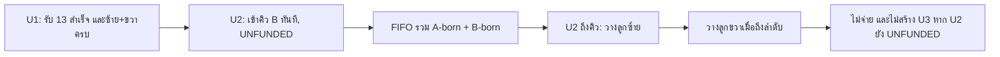

# 13VT — แบบจำลอง FIFO/UNFUNDED (เพื่อการศึกษา ไม่ใช่สัญญาจ่ายเงิน)

> **สถานะ:** ตัวอย่างการจัดคิว/สถานะเท่านั้น ไม่ใช่ Smart Contract สำหรับ USDT จริง ไม่มีการรับโทเคน ไม่มีการโอนเงิน ไม่มีการตรวจ Direct 2 ID จาก A และไม่มีการตรวจหลักฐานการจ่ายจริง ฟังก์ชัน `recordMockPayout` และ `recordMockFunding` เป็นข้อมูลจำลองจาก operator สำหรับการทดสอบเท่านั้น **ห้าม deploy แล้วนำไปสื่อว่าสมาชิกได้รับเงินจริง** และไม่ใช่การรับประกันรายได้

## ข้อเสนอ: วางลูกแล้วค้าง *การจ่าย* ไม่ค้าง *ตำแหน่ง*

เลือกนโยบาย **place-and-hold** สำหรับ U2 ที่ `UNFUNDED`:

1. U1 รับเงิน 13 สำเร็จหนึ่งครั้งและมีลูกซ้าย/ขวาครบ จึงเกิด U2 ใน Wallet เดิม **พร้อมเข้าคิว B ทันที** โดย `origin = FROM_B_REBORN`, `reserve = 0`, `paymentState = UNFUNDED` และ `claimable = 0`.
2. Position จาก A ที่ผ่านเกณฑ์หรือจาก B Reborn ใช้คิว FIFO เดียวกันในบทบาท Parent. เลือก **Parent ที่เข้าคิวก่อนสุดและมีช่องว่าง** เติม **ซ้ายก่อนขวา**. หาก U2 เป็น Parent ที่ถึงคิวแม้ `UNFUNDED` ก็ **วางลูกตามลำดับ**; ห้ามข้าม U2 ไปหา Parent ที่มาทีหลัง.
3. เมื่อลูกซ้ายถูกวางใต้ U2 ที่ยัง `UNFUNDED`: เก็บความสัมพันธ์และ emit event แต่ **ห้ามจ่ายเงิน ห้ามแสดง `PAID`/`CLAIMABLE` และห้ามสร้าง U3**. นี่เป็น `PLACED_UNFUNDED` ทางโครงสร้าง ไม่ใช่หนี้ 13 USDT ที่มีเงินรองรับ.
4. เมื่อลูกขวาถูกวางครบ: ปิดช่องทั้งสองของ U2 และเลื่อนหัวคิวไป Parent ถัดไปได้ แต่ **ยังไม่เกิด U3** เพราะกฎ Reborn ต้องมีทั้งการรับเงินที่ตรวจได้และลูกครบสอง. ระบบไม่ถอน reserve ของ A1/D หรือ Position อื่นไปเติม U2.
5. หากในอนาคตนิยามแหล่งเงินใหม่อย่างชอบธรรมและตรวจสอบได้ ให้บันทึก `depositId` แยกต่างหากและตรวจเงิน/ยอดผูกพันก่อนการจ่าย; หลังจ่ายสำเร็จครั้งเดียวจึง Reborn หากลูกทั้งสองครบอยู่แล้ว. **ไม่มีแหล่งเงินใหม่ตามคำอธิบายปัจจุบัน:** U2 คง `UNFUNDED` และไม่เกิด U3.

นโยบายนี้เป็น **ข้อเสนอ** เพื่อคงความเป็นธรรมของ FIFO และไม่บังคับให้รายการใหม่ล้มเหลวเพียงเพราะ Parent ไร้เงิน ไม่ใช่กฎที่ผู้ใช้ยืนยันไปก่อนหน้านี้. ก่อนใช้กับเงินจริงต้องตัดสินว่าต้องการ policy นี้หรือ policy พักการวาง และตรวจความเสี่ยงที่คิวจะขยายอย่างไม่จำกัดในขณะที่หลาย Parent ยังไม่มีเงิน.

## ผัง FIFO ตัวอย่าง

[เปิดผัง Mermaid](./fifo-unfunded.mmd) · [ภาพ PNG](./fifo-unfunded.png)



**เดินสถานะ:** สมมติ U1 เป็น Parent ว่างที่เก่าสุด; A1 มาซ้ายและ U1 ได้รับเงินจริงสำเร็จ, D มาขวาจึงเกิด U2. หลังจากนั้นหาก U2 ถึงคิวแต่ยังไม่มีเงินแล้ว Position E มาถึง ให้วาง E ทางซ้ายของ U2 โดย `paymentState(U2) = UNFUNDED`; F มาทีหลังได้ขวา, U2 เต็มสองช่องแต่ไม่เกิด U3. แม้มี Parent ใหม่ต่อท้าย ก็ไม่ข้าม U2 ในระหว่างที่ U2 ยังมีช่องว่าง.

## Solidity ตัวอย่างและข้อจำกัด

[`contracts/UnfundedFifoModel.sol`](./contracts/UnfundedFifoModel.sol) เป็น **status-only educational model**:

- มี FIFO หนึ่งชุด (`fifo`, `head`) และตำแหน่งที่มาจาก `QualifiedA` หรือ `RebornB`; ทั้งสองแหล่งใช้กฎเลือก Parent เดียวกัน.
- `place(childId)` เติมช่องซ้ายก่อนขวา **ไม่แตะ state เงิน**; จึงวางลูกของ U2 ที่ยัง `UNFUNDED` ได้โดยไม่แซงคิว.
- `recordMockPayout` จำลองเงื่อนไขว่า Parent ได้รับการจ่ายสำเร็จแล้ว ไม่ใช่การโอนเงินจริง; ถ้า U1 มีลูกครบสองแล้วจึง enqueue U2 ทันทีโดยไม่คัดลอก reference เงิน.
- `recordMockFunding` เก็บเพียง marker สาธิตจาก operator; **ไม่ได้ตรวจ depositId, balance หรือ ERC-20 transfer**. อย่าเรียกใช้กับเงินจริงหรือเอา marker นี้ไปเป็นข้ออ้างว่ามีทุน.
- `paymentState(id)` แยก `Unfunded`, `FundedPending` และ `Paid`. ไม่มีฟังก์ชันฝาก, โอน, ถอน, claim, fee หรือ backend sync.
- สิทธิ์ operator, seed root และการยืนยัน A ถูกจำลองเพื่อทดสอบเท่านั้น ไม่ใช่กลไกยืนยันบนเชน. Contract นี้อาจถูก deploy โดยใครก็ได้แต่ **ไม่ควร** ใช้จริง.

## ตรวจสอบและทดสอบ

จากโฟลเดอร์ `examples/unfunded-fifo`:

```bash
npm install
npm test
```

`npm test` คอมไพล์ Solidity และรันทดสอบธุรกรรมใน EVM จำลอง (`ganache` ในหน่วยความจำ) ไม่มีการส่งธุรกรรมไป BNB Chain หรือ Testnet. ครอบคลุม FIFO, ลำดับซ้าย→ขวา, U2 เข้าคิวทันทีหลัง U1 รับสำเร็จและครบคู่, `UNFUNDED` ที่ยังได้ลูก, ไม่จ่ายซ้ำ และไม่เกิด U3 โดยไม่มีการยืนยันเงิน. แพ็กเกจตัวอย่างแยกจากเว็บหลัก ไม่ต้อง deploy เว็บใหม่.

## ก่อนพัฒนา Contract ที่รับเงินจริง

ต้องระบุ ERC-20 address, เครือข่าย, source-of-funds ที่ตรวจสอบได้, การตรวจ Direct A, วิธีพิสูจน์เงินไม่ถูกกันซ้ำ, transaction rollback, transaction/gas limits, สิทธิ์ operator, ความปลอดภัยและกฎหมายที่เกี่ยวข้อง; สัญญานี้ **ไม่ครอบคลุม** สิ่งเหล่านั้น. ระบบที่จ่ายผู้เข้าร่วมเดิมด้วยเงินจากผู้เข้าร่วมใหม่มีความเสี่ยงสูงทางเศรษฐศาสตร์และกฎหมาย; ตัวอย่างนี้ไม่ควรนำไปใช้ในการระดมสมาชิกหรือเสนอผลตอบแทน.
